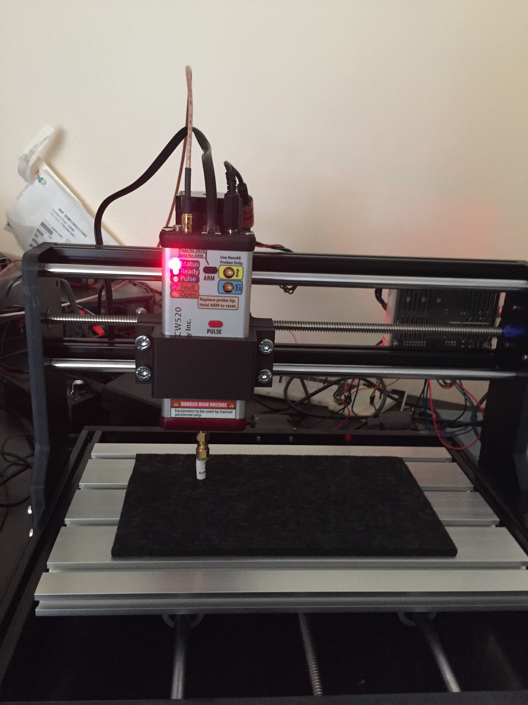
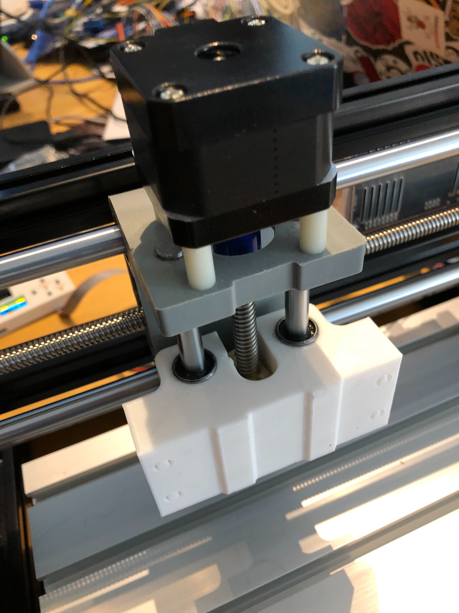

# CNC3018

CNC mount has 40mm height 

Recommended bearings are LM8UU

2x 8mm/15mm/24mm

and 2x from original handle of CNC3018

Make sure you install replacement bracket this way up or the clutch will jam:

# CNC3018-mod
